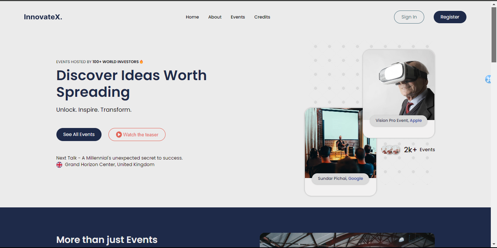
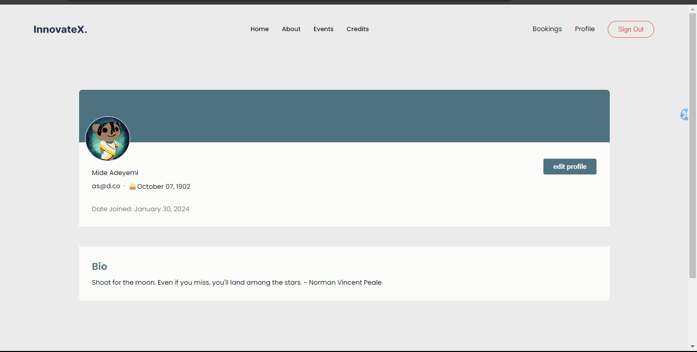

I've hosted it on my university server here - [Website](https://w22028079.nuwebspace.co.uk/KF7013/content/index.php)

  
  

# InnovateX Event Booking Website

## Description
InnovateX is an event booking website for tech, business, and entrepreneurship events, similar to TED Talks. Built with vanilla HTML, CSS, JavaScript, PHP, and MySQL, it features user authentication, profile management, and event booking functionalities.

## Features
- **User Authentication:** Secure login and registration.
- **Profile Management:** Users can manage their profiles.
- **Event Booking:** Interface for booking events.
